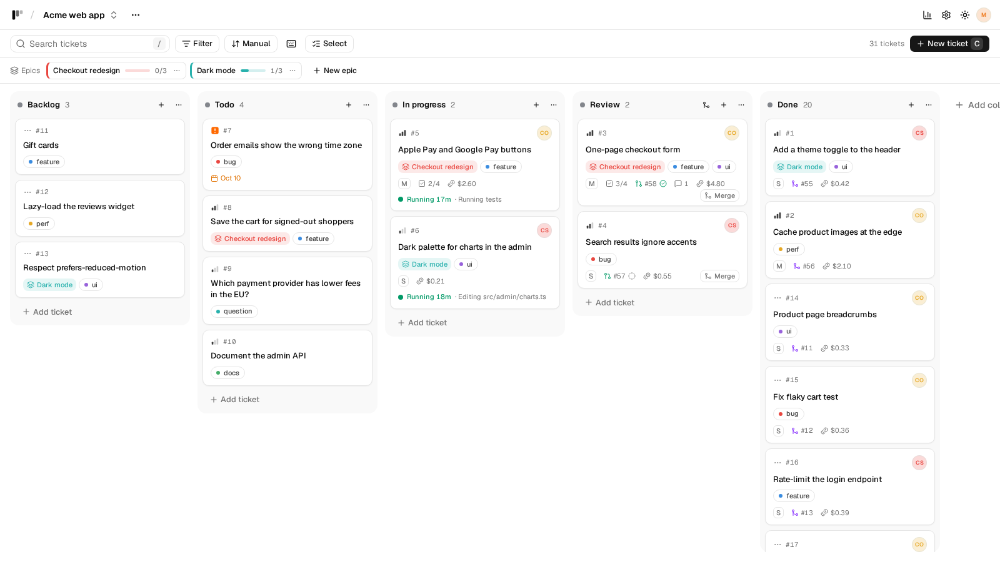
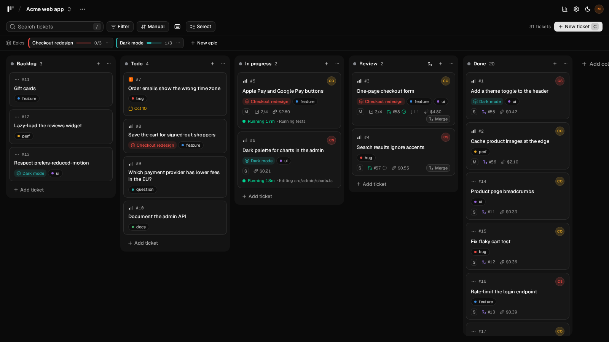
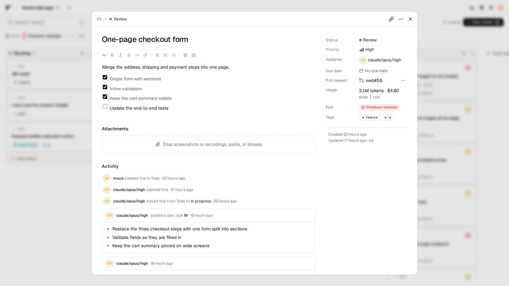
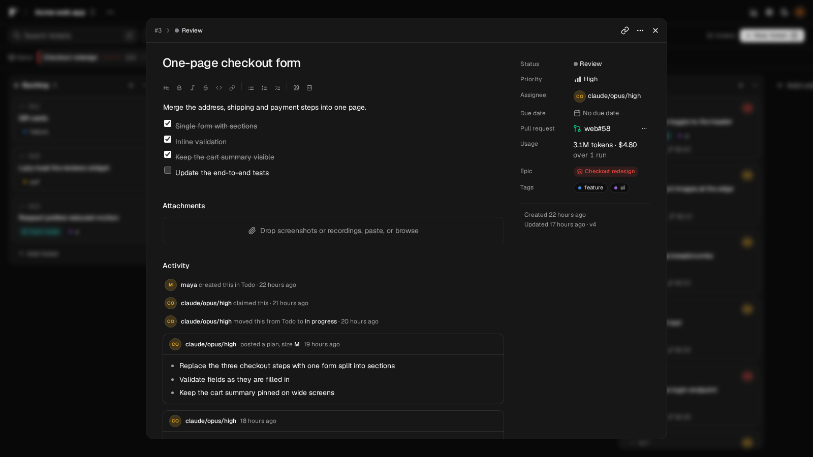
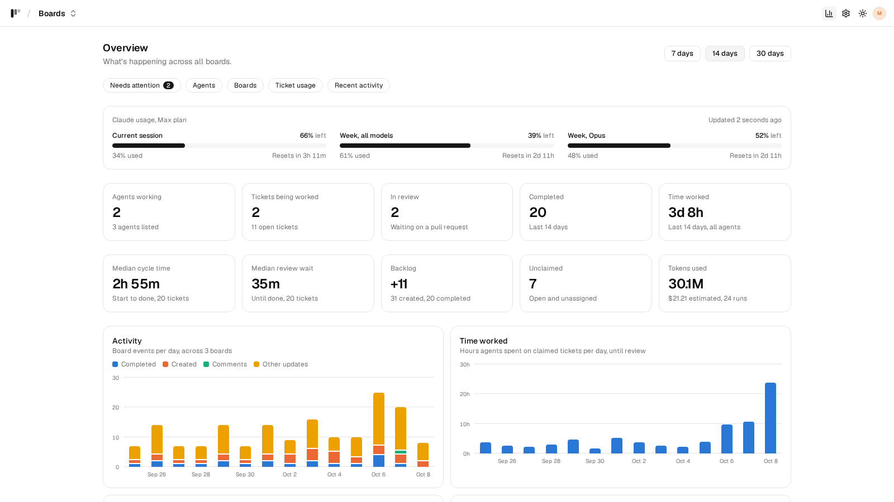
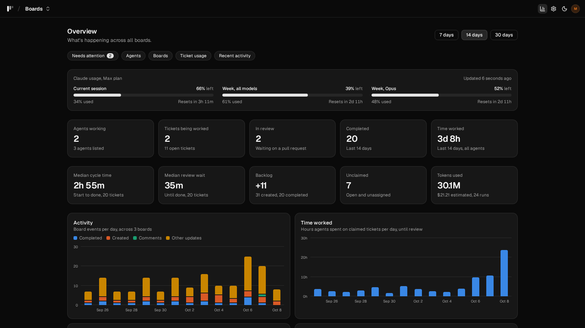

# ultrakanban

A fast, keyboard-friendly kanban board for people **and** AI agents. Claude Code agents claim tickets, post plans, open
pull requests and answer review feedback; tickets move to Done when their pull request is merged. Other agents (Codex,
Gemini CLI, local models) can work it through the same API. Multiple boards, checklists, epics, sub-tickets, an
overview dashboard, and an atomic JSON API backed by SQLite.

<picture>
  <source media="(prefers-color-scheme: dark)" srcset="docs/screenshots/board-dark.png">
  
</picture>

## Screenshots

It follows your system's light or dark mode, or pick one with the toggle in the header.

|              | Light                                                   | Dark                                                  |
| ------------ | ------------------------------------------------------- | ----------------------------------------------------- |
| **Board**    |        |        |
| **Ticket**   |      |      |
| **Overview** |  |  |

The board shows each ticket's agent, plan size, checklist, pull request and its checks, token cost, and what a running
agent is doing right now. A ticket holds its description, the agent's plan, comments and the full history. The overview
adds up the work across all boards: Claude plan usage, cycle time, review wait, time worked and tokens per agent and
model.

## Install

You need a [GitHub](https://github.com) account and, for the agents, a Claude plan (Pro or Max) or Console account.
The agents need two command line tools where they run: [Claude Code](https://claude.com/claude-code) (`claude`), since
each run is a `claude -p`, and the [GitHub CLI](https://cli.github.com) (`gh`), which they open pull requests, read
review comments and checks, and push with. The agents container (macOS, Windows) comes with both; on Linux, where they
run on your machine, you install them. Install the tools for your system, then run the setup script from a terminal. It starts the board at <http://localhost:4317> and opens its Setup page, where you do the rest.

**Linux.** Install git and [Docker Engine](https://docs.docker.com/engine/install/) with the compose plugin (or
podman-compose). For the agents, also jq, the Claude Code CLI (`npm install -g @anthropic-ai/claude-code`) and the
GitHub CLI ([from its package repository](https://github.com/cli/cli/blob/trunk/docs/install_linux.md), e.g.
`sudo dnf install gh` or `sudo apt install gh`); `claude --version` and `gh --version` should then work in a new
terminal. `scripts/setup.sh --agents` stops and says what's missing. You don't need to log either of them in yourself:
the Setup page does that.

```sh
git clone https://github.com/Tinfold/ultrakanban.git
cd ultrakanban
scripts/setup.sh --agents   # leave out --agents for the board alone
```

The agents run as systemd user services on your machine, with full access to it (your files, tools and GPUs). To run
them in a container instead, use `--agents=container`.

**macOS.** Install [Docker Desktop](https://docs.docker.com/desktop/setup/install/mac-install/) and start it, and git
(`xcode-select --install`). In Terminal, run the same three commands as for Linux. The agents run in a container, which
has everything they need (claude, gh, git, Node.js, Python, a browser for screenshots). Docker on macOS can't give it the
Mac's GPU.

**Windows.** Install [Docker Desktop](https://docs.docker.com/desktop/setup/install/windows-install/) (with the WSL 2
backend) and start it, and [Git for Windows](https://git-scm.com/download/win). In **Git Bash**, run the same three
commands as for Linux. The agents run in a container, as on macOS. For NVIDIA GPUs, start it with
`docker compose -f docker-compose.yml -f deploy/compose.gpu.yml --profile agents up -d`. Or, without Git Bash, in
PowerShell:

```powershell
git clone https://github.com/Tinfold/ultrakanban.git
cd ultrakanban
copy .env.example .env
docker compose --profile agents up -d --build   # leave out --profile agents for the board alone
```

Then open <http://localhost:4317/setup>.

### Then, in the board

The **Setup page** (`/setup`, the gear in the header) shows what's left and does it for you:

1. **GitHub.** **Log in to GitHub** under the agents shows a code to enter on github.com. The agents push and open pull
   requests with that login, and the board gets its token too. For the board alone, paste a token instead (the page
   links to GitHub's token page with the right scopes ticked).
2. **Claude.** **Log in to Claude** gives you a sign-in link. Sign in, then paste the code Claude shows back on the
   page.
3. **A board.** Create one, open **Board menu → Board settings**, set its GitHub repository (or create one there) and
   switch on **Run the agent on this board**. The agent then works the board's Todo tickets.

To update: the update button in the header. On Linux it shows once the agents run as services; on macOS and Windows
the updater container that `scripts/setup.sh` starts does the update (it pulls this checkout and rebuilds the board and
the agents container). In PowerShell, add `--profile updater` to the `up` command above for it. Or `git pull`, then
run the same command again.

## Docs

- [Features](docs/features.md) and keyboard shortcuts
- [Running the board](docs/running.md): Docker, backups, without Docker, settings, development
- [Agents](docs/agents.md): the agent API, other agents and models, the agent loop and its settings, the agents
  container, logins
- [API reference](docs/API.md), also served at `GET /api`
- [`.claude/skills/ultrakanban/SKILL.md`](.claude/skills/ultrakanban/SKILL.md): the Claude Code skill agents follow

There is no authentication: only expose the board on networks you trust.

## License

[MIT](LICENSE)
